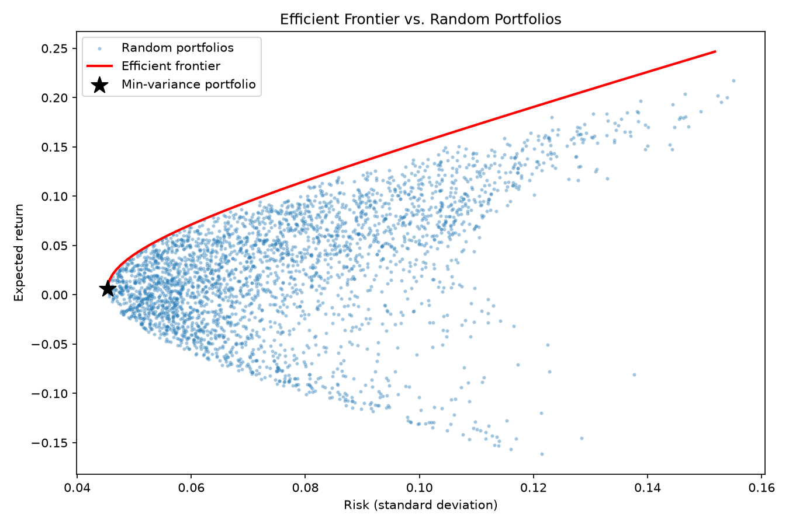
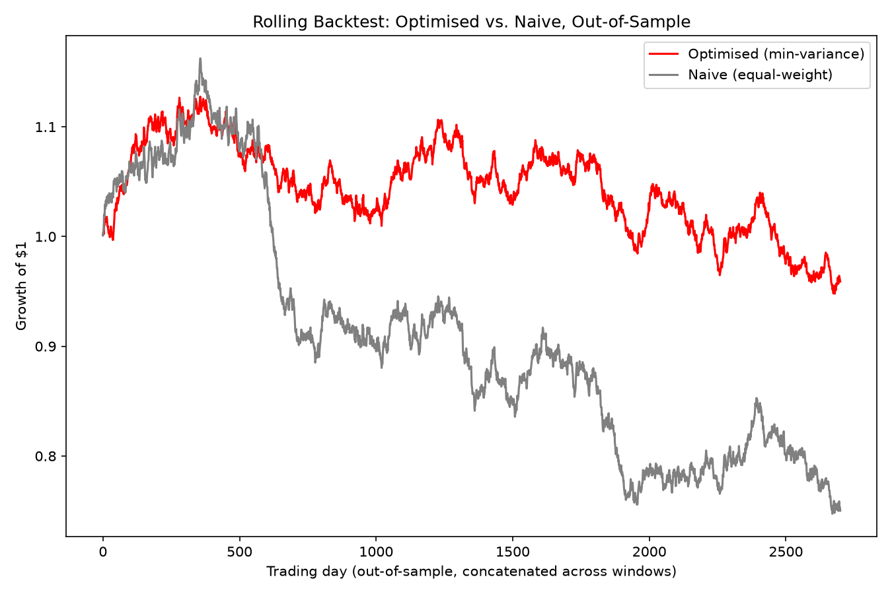

# Markowitz Portfolio Optimisation

Closed-form mean-variance portfolio optimisation, following Harry
Markowitz's 1952 "Portfolio Selection" solved with matrix algebra
(Lagrange multipliers).

## Structure

- `portfolio/data.py` -- load real prices (`yfinance`) or generate
  synthetic prices with a predetermined correlation structure, for testing
  the math without network access
- `portfolio/stats.py` -- turn prices into returns, an expected-return
  vector, and a covariance matrix
- `portfolio/optimiser.py` -- the actual Markowitz math: the global
  minimum-variance portfolio, the efficient frontier, and random portfolios
  for comparison
- `portfolio/backtest.py` -- out of sample evaluation. Finds the optimal
  weights using a training window and tests them later on a test window. Optimal weights are tested against an evenly distributed portfolio.
- `main.py` -- entry point: loads data, runs the optimiser, plots the
  efficient frontier against a cloud of random portfolios

## Setup

```
pip install -r requirements.txt
```

## Run

```
python3 main.py
```

By default, this uses simulated price data (`simulate_prices` in
`data.py`), so it works immediately with no internet access. To use
real data, uncomment the `load_prices(...)` line in `main.py` and
supply real tickers -- requires `yfinance` and an internet connection.

## What to expect



`efficient_frontier.png` shows the classic Markowitz picture: a cloud
of randomly-weighted portfolios, and a curved red line (the efficient
frontier) tracing its upper-left boundary -- the best possible
risk/return trade-off achievable from this set of assets. The black
star marks the global minimum-variance portfolio.

## Backtesting

The optimised portfolio is tested against a naive strategy (1/N weighted, where a portfolio
is divided equally into each asset). We find the global minimum-variance strategy over a 250-day
training window and applied those fixed weights to the next 60 days of data. The window then slides
forward and repeats across the full price history.

Example Run (3000days of simulated data, 45 windows):

|                              | Optimised (min-variance) | Naive (equal-weight) |
| ---------------------------- | ------------------------ | -------------------- |
| Win rate (mean daily return) | Row 1 Col 2              | Row 1 Col 3          |
| Daily Volatility             | 51.1%                    | 48.9%                |
| Growth of $1                 | 0.96                     | 0.75                 |

The optimised portfolio's win rate is close to a coin flip (not reliably
better at picking a higher daily average than the naive approach). But due to volatility drag,
the optimised approach's cumulative growth (0.96x) is well above the naive approach's (0.75).



`rolling_backtest.png` shows the cumulative growth of $1 over the full period
of the optimal solution against the naive approach.
